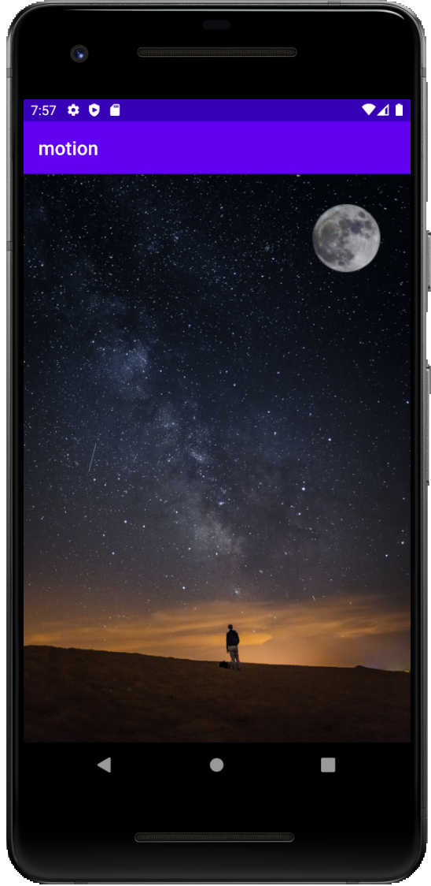

# sample.motion.moon

AndroidStuio 4.0 introduced the Motion Editor which is a visual tool to build constraint-set transition.  
This is the sample source code showing araising moon in night sky.

Here is the link of youtube for details about source code  
https://youtu.be/Gork7SUKGSY

